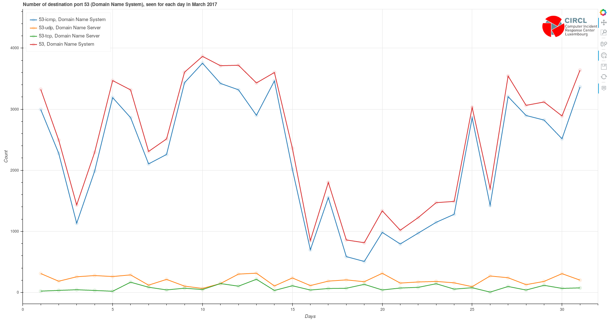
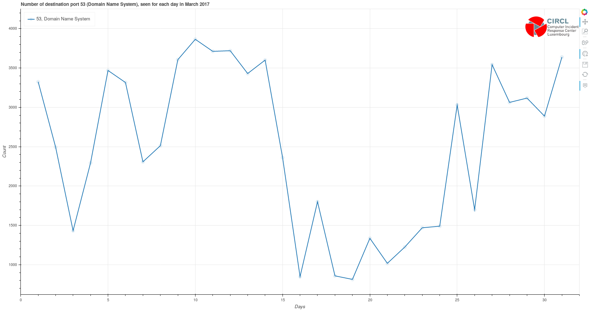

# potiron

potiron -  Normalize, Index, Enrich and Visualize Network Capture

potiron is a tool to analyze a series of network capture (pcap) files, parse these with standard tools and normalize
it in JSON format. Then the JSON format is imported into a Redis database to visualize the
normalized information.

The current version potiron supports ipsumdump and tshark.


## Install

**IMPORTANT**: Use [pipenv](https://pipenv.readthedocs.io/en/latest/)

**NOTE**: It requires python3.6+

**Various packages required**:
* libgeoip-dev
* tcl8.5 (in order to `make test` to install redis, look below)
* Flask
* tshark
* npm

### Install redis

```bash
git clone https://github.com/antirez/redis.git
cd redis
git checkout 5.0
make
make test
cd ..
```

### Install potiron

```bash
git clone https://github.com/CIRCL/potiron
cd potiron
pipenv install
echo POTIRON_HOME="'`pwd`'" > .env
pipenv shell
pip install -e .
npm install -g phantomjs-prebuilt
cd ./var/www
bash ./update_thirdparty.sh
```

## Usage

### Start/Stop the redis instance(s)

```bash
run_redis.py --start --status
```
Alternatively you can specify which instance to run, by specifying its name using the `-n` parameter.

For instance: `run_redis.py --start -n standard`

Note that all the required files to run 2 redis instances are provided by default: `standard` and `isn`

```bash
# Obviously, following the same model:
run_redis.py --stop
# Which uses the same parameter to specify any instance name as well
```

### Create, delete or flush redis instances

```bash
# Create a new redis instance, which will be identified by the name you give to it
manage_redis.py -c -n new_redis_instance

# Delete any existing instance
manage_redis.py -d -n any_instance_name
# Be aware that without specifying any name, it will delete all the existing instances

# Flush any running redis instance
manage_redis.py -f -n any_running_instance_name
# Be aware that without specifying any name, it will flush all the running instances
```

### Store data from pcap files in a redis instance

```bash
parse_pcap_files.py -u redis_backends/standard/standard.sock -i PATH_TO_ANY_PCAP_FILES
```

Parameters:
* `-u`: Unix socket to connect to a redis instance *(Mandatory)*
* `-i`: Path to the pcap files you want to store *(Mandatory)*
* `-tf`: Tshark filter *(To select only certain samples of data)*
* `-ej`: Store data into json files as well *(Optional)*
* `-o`: Output directory for the JSON files *(Used only if `-ej` is set as well)*
* `--isn`: Store ISN values of the packets *(Instead of using the standard format of data storage which is used by default)*
* `-l2`: Store Layer2 values of the packets *(Instead of using the standard format of data storage which is used by default)*
* `-ff`: Fields to store *(Only available with the standard format storage, all the default fields are saved otherwise)*
* `-ck`: Use combined keys to separate each value stored by protocol *(Only available with the standard format storage)*

### Create interactive graphics

**/!\ REWORK STILL IN PROGRESS, DOCUMENTATION TO COME ONCE IT IS DONE, SOON /!\\**

**NOTE**: On the other hand, GNU plot visualization provided with the server's part is working as expected

For all the following graphs, the parameters used are :

* -s, the honeypot source where the data come from
* -f, the field related to the informations you want to display
* -d, the date on which the informations have been collected
* -o, the output directory
* -u, the unix socket used open the redis client
* -i, the pcap files read in input
* -ck, set use of combined keys to true

First you need to define a root directory where all the JSON files will be exported. Then you need
to proceed your network capture files to generate the JSON files :

Process with ipsumdump :

	./potiron-json-ipsumpdump.py -c -i /tmp/test-honeypot-1-20140826000000.cap.gz -o ../out/
	potiron[24989]: [INFO] Created filename ../out/2014/08/26/test-honeypot-1-20140826000000.json

Or process with tshark :

	./potiron-json-tshark.py -c -i /tmp/test-honeypot-1-20140826000000.cap.gz -o ../out/
	potiron[24989]: [INFO] Created filename ../out/2014/08/26/test-honeypot-1-20140826000000.json

  Additional functionalities grant you the possibility to filter data :
  - '-ff' is the parameter filtering fields : only the fields specified (+ timestamp & protocol) will be included in the datafiles
  - '-tf' is the Tshark Filter, filtering the data displayed from the capture files processing

  As a result, both field and tshark filters can be used in parallel to select a specific part of the whole data, when using combined keys is a way to separate in redis values coming from tcp packets and values coming from udp, icmp, GRE, etc packets. Please note that these two filters should be defined with wireshark / tshark typography !

    Example :

        ./potiron-json-tshark.py -c -i /tmp/test-honeypot-1-20140826000000.cap.gz -o ../out/ -ff tcp.srcport tcp.dstport udp.srcport udp.dstport -tf "tcp.srcport eq 80 or tcp.dstport eq 80" -r -u /tmp/redis.sock -ck

Then the JSON file can be imported into the Redis database :

	./potiron-redis.py --filename ../out/2014/08/26/test-honeypot-1-20140826000000.json --unix /tmp/redis.sock

  As the tshark module uses this one to process the storage in redis, combined keys are available here as well.

  But it is also possible to skip JSON storage and save directly data in Redis, using the '--disable_json' (equals to '-dj') argument. In this case, specifying an output directory is not needed but make sure the path of the unix socket is filled out.
  An example of command processing storage directly in Redis, skipping JSON, could then be:

      ./potiron-json-tshark.py -c -i /tmp/test-honeypot-120140826000000.cap.gz -u /tmp/redis.sock -dj

Some specific data fields can be represented into graphics (multiple values can be specified after parameter '-v') :

	./bokeh_month.py -s test-honeypot-1 -f dport -v 22 -d 2017-03 -u /tmp/redis.sock -o ./out/ --logo /home/user/Pictures/logo.png

The last parameter --logo is optionnal and is the ABSOLUTE path of the logo file which will be displayed. If no argument is given, the default file is the CIRCL logo stored in the doc/ directory of potiron.

Here, the -v parameter is important and there are some different possible combinaisons:
  - Using the format "value-protocol" allows you to display data for some specific protocols (for instance, with ports: 22-tcp). Moreover it is possible to display data for each protocol existing in your actual redis database by replacing the protocol after the '-' by a \* caracter (another example with ports => 80-\* instead of specifying 80-tcp 80-udp 80-icmp etc.).
  This requires that you use combined keys from the beginning and store your data with this structure.
  - On the other hand, however data is stored (combined keys or not), it is possible to display the entire data content for a field, simply using the format "value".

  As long as combined keys are used, it is also possible to display data following both of the two cases (as ports are good examples for which it is interesting to use combined keys, for instance "22-tcp 22" as src or dst port values parameter will show the differences between the scores of ports 22 seen with tcp protocol, and all the ports 22 seen).

In order to have working redirections in this plot, the resulting graphs should be created first. To do so, .csv files should be processed :

	./export_csv_all_days_per_month.py -s test-honeypot-1 -f dport -d 2017-03 -u /tmp/redis.sock -o ./out/ -l 10 --skip -1

The -l parameter is used to define the number of most frequent values to display (default number is 20)
The --skip parameter can be used to specify values to exclude in the graph.

Each one of these files can also be reprocessed separatly:

	./export_csv_day.py -s test-honeypot-1 -f dport -d 2017-03-01 -u /tmp/redis.sock -o ./out/ -l 10 --skip -1

Statistics for an entire month can also be displayed as well. The data file used in this case is created with the following :

	./export_csv_month.py -s test-honeypot-1 -f dport -d 2017-03 -u /tmp/redis.sock -o ./out/ -l 10 --skip -1

These files contain the data which will be used as data source in the graphs. The next step to do is creating the graphs with the data sources.

	./generate.sh ./out/ /home/user/Pictures/logo.png

The script will simply generate all the .html files using template.html to build the graphs.
Having both generate.sh and template.html in the same path is recommanded.
The first parameter used here is the location of the .csv files, and the .html output files will be created in the same directory. The second parameter is optionnal and is the absolute path of the logo file which will be displayed. If no argument is given, the default path is the same used for the bokeh graph, which is the CIRCL logo stored in the doc/ directory of potiron.

In a default usage, combined keys are deployed in the redis database and data is stored by protocol. However, it is possible to display only the grouped values of all the dataset (i.e for all the protocols) by using "-p" parameter. This will set a variable to False in order to avoid treating each protocol separatly. On any case, when combined key are not used, the variable is automatically set to false to avoid errors.

In order to automatize some operations, it is possible to use the "--links" parameter in bokeh-export module in order to auto-generate all the bubble charts usefull to have all the links working. The same parameter is also available in all the export-csv modules, generating the plots with bokeh for each value in bubbles.
Finaly, bubble charts can be generated as well directly from the csv files using the "--generate" or "-g" parameter in any export-csv module.
When auto-generation parameter is called with bokeh module, both auto-generation parameters in export-csv module are called as well.

Example:

    ./export_csv_all_days_per_month.py -s test-honeypot-1 -f dport -d 2017-03 -u /tmp/redis.sock -o ./out/ -g -p

First, this command produces the same visual result regardless of the usage or not of the "-p" parameter, and only the name will be different.


But the difference relies upon the links on each bubble. For users, using "-p" means "without protocols":
  - without the "-p" parameter, on this example the bubbles point on plots displaying the count of each destination port separated by protocol
  

  - with "-p", only the red line of the previous plot is displayed, showing only the sum of all destination ports 53 for the complete dataset
  

## Summary (deprecated version)

* Usual potiron functionalities :
    - potiron-json-ipsumdump : create json files from pcap files
        - input : pcap files
        - output : corresponding json files

    - potiron-json-tshark : create json datafiles from pcap capture files, and potentially store data in redis directly
        - input : pcap files
        - output : corresponding json files, and / or redis
    - potiron-redis : stores data from json files in redis
        - input : json files
        - output : redis
    - bokeh-export : process graphs to display specific values of a field for a month
        - input : redis data
        - output : bokeh plot
    - export-csv-\* : process datafiles for the graphs of the most frequent values of a field, the period depends on the parameter specified in the \* caracter's place
        - input : redis data
        - output : csv data files
    - generate : creates graphs corresponding to the csv files, using template.html as the template of the graph
        - input : csv data files
        - output : d3.js bubble charts
    - potiron_graph_annotation is used to put the real name of the fields / values displayed in the graphs, instead of their variable name, using dictionaries stored in "doc" directory

* Additionnal functionalities :
    - isn-pcap / isn-pcap-process-day : use pcap files to process graphs of the sequence and acknowledgement numbers over time, with the destination port indicated as the color of the dots
        - input : pcap files
        - output : ISN graphs
    - potiron-isn-redis : stores data from json files in a time series redis structure in order to process ISN graphs directly from redis
        - input : pcap files
        - output : json files, and / or redis
    - potiron-isn-redis-from-json : stores data from json files in redis
        - input : json files
        - output : redis
    - isn-redis / isn-redis-process-day : process ISN graphs with data from redis
        - input : redis data
        - output : ISN graphs
    - preview : displays a preview of all the ISN graphs for a month as an index, with links to each original graph
        - input : ISN graphs images
        - output : index of all the previews
    - parallel-coordinate : process csv files containing data used to display parallel coordinates of the daily most frequent values of a field for a month
        - input : redis data
        - output : csv data files
    - generate-pc : creates parallel coordinate graphs with the csv files, using template-pc.html as template
        - input : csv data files
        - output : d3.js parallel coordinate graphs
